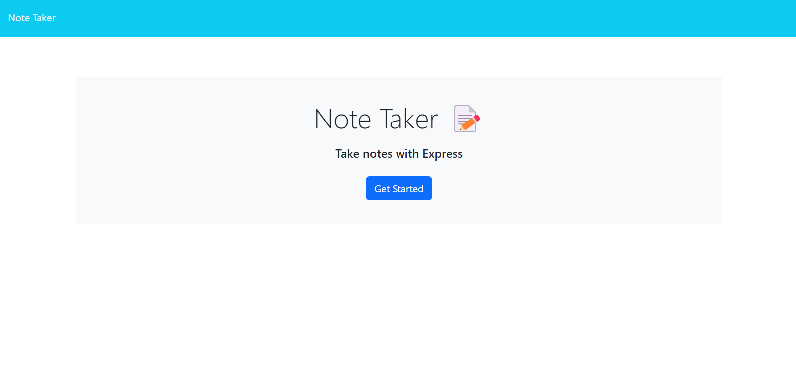
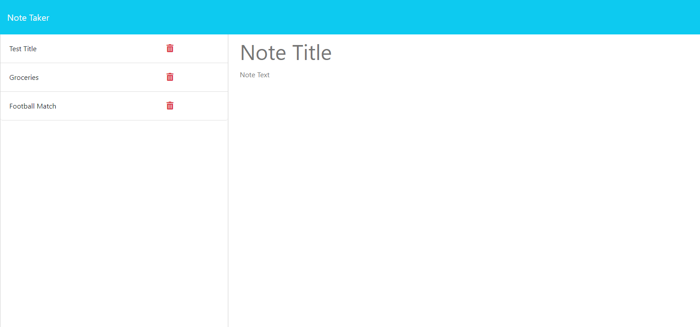
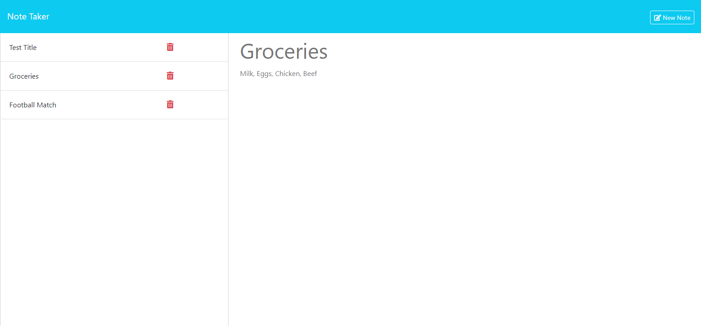

## Note Taker App

## User Story
AS A small business owner
I WANT to be able to write and save notes
SO THAT I can organize my thoughts and keep track of tasks I need to complete

## Acceptance Criteria
GIVEN a note-taking application
WHEN I open the Note Taker
THEN I am presented with a landing page with a link to a notes page
WHEN I click on the link to the notes page
THEN I am presented with a page with existing notes listed in the left-hand column, plus empty fields to enter a new note title and the note’s text in the right-hand column
WHEN I enter a new note title and the note’s text
THEN a "Save Note" button and a "Clear Form" button appear in the navigation at the top of the page
WHEN I click on the Save button
THEN the new note I have entered is saved and appears in the left-hand column with the other existing notes and the buttons in the navigation disappear
WHEN I click on an existing note in the list in the left-hand column
THEN that note appears in the right-hand column and a "New Note" button appears in the navigation
WHEN I click on the "New Note" button in the navigation at the top of the page
THEN I am presented with empty fields to enter a new note title and the note’s text in the right-hand column and the button disappears

## Table of Contents
- [Description](#description)
- [Technologies](#technologies)
- [Links](#links)
- [Screenshots](#screenshots)
- [Usage](#usage)
- [Credits](#credits)
- [Questions](#questions)

## Description
I've created a simple note taker application. When opening the home page, the user is presented with a landing page with a link to the note page. When the user clicks on the button, they are taken to the application. The user inserts a title and a description for the note, a save button appears. When the user presses the save button, the note is saved and displays on the left hand column with other existing notes. When an existing note in the list in the left-hand column is clicked, then that note appears in the right hand column.

## Technologies
This application utilizes:
1. Visual Studio Code
2. Node.js
3. Express package
4. GitHub
5. Heroku

## Links
- [GitHub-Repository](https://github.com/allexortiz/note-taker-app)
- [Heroku-Link]

## Screenshots

## Usage
1. Open the website.
2. Click the Get Started button.
3. Enter your note's title and text into the appropriate fields in the right-hand portion of the screen.
4. Click the Save icon in the navigation bar in the top right of the screen.

## Credits
- Instructor - Tyler Calvert
- Tutor - Dennis Itua

## Questions
If you have any addition questions feel free to reach me at either my github or email address.

[Github](https://github.com/allexortiz)

[Email](allexortiz@outlook.com)